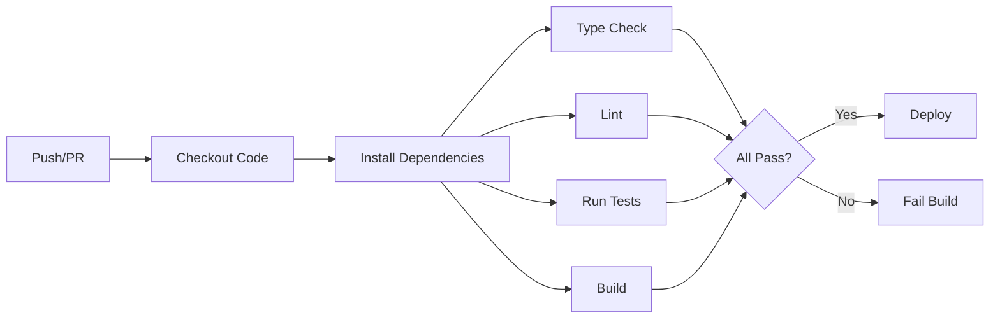

# 🚀 React CI/CD Template

[](https://github.com/donedgardo/react-ci-cd-template/actions/workflows/ci.yml)
[](https://codecov.io/github/donedgardo/react-ci-cd-template)

A modern, production-ready React template with best-in-class CI/CD practices, testing infrastructure, and developer tooling. Built to help teams ship faster with confidence.

## ✨ Features

### 🛠️ Modern Tooling
- ⚡ **Vite** - Lightning-fast build tool and development server
- ⚛️ **React 18** - Latest React with concurrent features
- 📘 **TypeScript** - Type safety and better developer experience

### 🧪 Testing Infrastructure
- ✅ **Vitest** - Fast unit testing with Jest-compatible API
- 📸 **Testing Library** - Best practices for component testing
- 🎭 **Playwright** *(Planned)* - End-to-end testing framework
- 📊 **Code Coverage** - Built-in coverage reporting

### 🔄 CI/CD Pipeline
- 🤖 **GitHub Actions** - Automated testing and deployment
- 📦 **Build Verification** - Automated build checks on every PR
- 🚀 **Deployment Automation** *(Planned)* - Automated deployments to hosting platforms

### 🎯 Developer Experience
- 🔥 **Hot Module Replacement** - Instant feedback during development
- 🎨 **Component-Driven Development** - Build UI components in isolation
- 📦 **Zero-Config Setup** - Works out of the box

## 🚀 Quick Start

### Use This Template

Click the "Use this template" button above or:

```bash
# Clone the repository
git clone https://github.com/donedgardo/react-ci-cd-template.git my-project
cd my-project

# Install dependencies
npm install

# Start development server
npm run dev
```

Visit `http://localhost:5173` to see your app running.

## 📋 Available Scripts

| Command | Description |
|---------|-------------|
| `npm run dev` | Start development server with HMR |
| `npm run build` | Build production bundle |
| `npm run preview` | Preview production build locally |
| `npm run test` | Run unit tests |
| `npm run test:ui` | Run tests with UI interface |
| `npm run test:coverage` | Generate coverage report |

## 🔧 Project Structure

```
react-ci-cd-template/
├── .github/
│   └── workflows/
│       └── ci.yml              # Main CI/CD pipeline
├── src/
│   ├── components/             # React components
│   ├── hooks/                  # Custom hooks
│   ├── utils/                  # Utility functions
│   ├── App.tsx                 # Main app component
│   └── main.tsx               # Entry point
├── tests/                      # All tests (unit, integration, e2e)
├── public/                     # Static assets
├── vitest.config.ts           # Vitest configuration
├── vite.config.ts             # Vite configuration
└── tsconfig.json              # TypeScript configuration
```

## 🔄 CI/CD Workflow

This template includes a comprehensive CI/CD pipeline that runs on every push and pull request:

### Continuous Integration (CI)



**What it does:**
- ✅ Installs dependencies
- ✅ Runs all unit and integration tests
- ✅ Generates code coverage reports
- ✅ Builds production bundle

### Continuous Deployment (CD) *(Planned)*

**Deployment Options:**

1. **GitHub Pages** - Free hosting for static sites
2. **Vercel** - Zero-config deployments with preview URLs
3. **Netlify** - Continuous deployment with form handling
4. **AWS S3 + CloudFront** - Scalable cloud hosting
5. **Azure Static Web Apps** - Enterprise-grade hosting
6. **Cloudflare Pages** - Fast global CDN

## 🌳 Trunk-Based Development

This template follows **trunk-based development** practices, where developers collaborate on a single branch (trunk/main) with short-lived feature branches.

### Why Trunk-Based Development?

**Benefits:**
- 🚀 **Faster Integration** - Changes merge quickly, reducing integration conflicts
- 🔄 **Continuous Feedback** - Issues surface early through automated testing
- 📦 **Smaller Changes** - Encourages incremental, reviewable commits
- 🎯 **Simplified Workflow** - No complex branching strategies or long-lived branches
- 🤝 **Better Collaboration** - Team stays aligned on a single codebase state
- 🐛 **Easier Debugging** - Less time tracking down when bugs were introduced

### How It Works

1. **Short-lived branches** - Feature branches live for hours or days, not weeks
2. **Frequent commits** - Merge to main multiple times per day
3. **Always deployable** - Main branch is always in a releasable state
4. **CI/CD safety net** - Automated tests catch issues before merge
5. **Feature flags** - Deploy incomplete features hidden behind flags

### Common Misconceptions

❌ **"You need perfect code before merging"**  
✅ Code should be tested and working, but doesn't need to be perfect. Iterate in production.

❌ **"It's too risky without long-lived branches"**  
✅ Comprehensive CI/CD and automated testing make it safer than infrequent large merges.

❌ **"You can't work on big features"**  
✅ Use feature flags to deploy incrementally while keeping features hidden until ready.

❌ **"Code review quality suffers"**  
✅ Smaller, frequent changes are actually easier to review thoroughly.

❌ **"You need a huge team"**  
✅ Works for teams of any size - even solo developers benefit from the discipline.

### Best Practices

```bash
# 1. Pull latest changes frequently
git pull origin main

# 2. Create short-lived feature branch
git checkout -b quick-fix-button

# 3. Make small, focused changes
# ... make changes ...

# 4. Run tests locally
npm test

# 5. Merge quickly (same day if possible)
git push origin quick-fix-button
# Create PR, get review, merge to main
```

**Key principles:**
- Merge to main at least once per day
- Keep feature branches under 24 hours when possible
- Use feature flags for work-in-progress features
- Trust your CI/CD pipeline
- Fix broken builds immediately

## 🧪 Testing Strategy

### Unit Tests
```bash
npm run test
```
Test individual components and functions in isolation.

### Integration Tests
```bash
npm run test:integration
```
Test how components work together.

### E2E Tests *(Planned with Playwright)*
```bash
npm run test:e2e
```
Test complete user workflows in a real browser.

### Coverage Reports
```bash
npm run test:coverage
```
View detailed coverage metrics in the terminal or `coverage/` directory.

## 🔐 Security

Security best practices:
- **Dependency Updates** - Keep dependencies up to date
- **HTTPS Everywhere** - Secure connections in production
- **Environment Variables** - Secure handling of sensitive data

## 📦 Deployment

### Manual Deployment

Build and deploy manually:

```bash
# Build for production
npm run build

# The built files will be in the dist/ folder
# Upload to your hosting provider
```

### Automated Deployment *(Coming Soon)*

Automatic deployments will be configured for:
- Merges to `main` → Production
- Merges to `develop` → Staging
- Pull Requests → Preview URLs

## 🎨 Customization

### Configuring CI/CD

Edit `.github/workflows/ci.yml` to customize:
- Node.js version
- Test commands
- Build scripts
- Deployment targets

## 📊 Code Quality

This template maintains code quality through:

- **Automated Testing** - Comprehensive test suite runs on every commit
- **Code Coverage** - Track test coverage metrics
- **Type Safety** - TypeScript catches errors at compile time
- **CI/CD Checks** - All tests must pass before merging

## 🤝 Contributing

Contributions are welcome! Please follow these steps:

1. Fork the repository
2. Create a feature branch (`git checkout -b feature/amazing-feature`)
3. Make your changes and add tests
4. Ensure all tests pass (`npm test`)
5. Push to the branch (`git push origin feature/amazing-feature`)
6. Open a Pull Request

## 🗺️ Roadmap

### ✅ Completed
- [x] Basic React + Vite setup
- [x] TypeScript configuration
- [x] Unit testing with Vitest
- [x] CI pipeline with GitHub Actions
- [x] Code coverage reporting

### 🚧 Planned
- [ ] **E2E testing with Playwright**
- [ ] **Automated deployment**
  - [ ] GitHub Pages integration
  - [ ] Vercel deployment option
  - [ ] AWS S3/CloudFront option
- [ ] **Code Quality Tools**
  - [ ] ESLint integration
  - [ ] Prettier code formatting
  - [ ] TypeScript strict checks
  - [ ] Pre-commit hooks with Husky
- [ ] Storybook integration
- [ ] Performance monitoring
- [ ] Visual regression testing

## 📚 Resources

- [React Documentation](https://react.dev)
- [Vite Documentation](https://vitejs.dev)
- [Vitest Documentation](https://vitest.dev)
- [GitHub Actions Documentation](https://docs.github.com/actions)
- [Playwright Documentation](https://playwright.dev)

## 📄 License

This project is licensed under the MIT License - see the [LICENSE](LICENSE) file for details.

## 🙏 Acknowledgments

Built with modern best practices inspired by:
- React team's official recommendations
- Vite's performance-first approach
- Testing Library's user-centric testing philosophy
- DevOps community's CI/CD patterns

---

**Made with ❤️ for developers who want to ship fast and break nothing.**

Star ⭐ this repo if you find it helpful!
